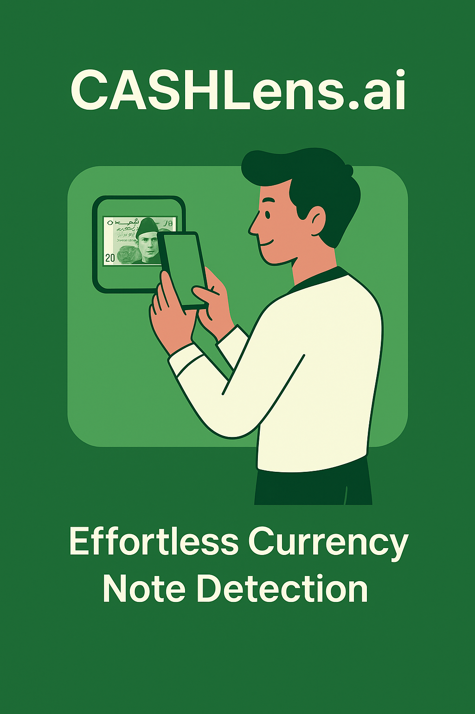

# CashLens.ai - Pakistani Currency Recognition



CashLens.ai is an AI-powered web application that instantly identifies Pakistani currency notes using advanced computer vision and deep learning technology. The application provides real-time currency recognition with voice feedback, making it especially useful for visually impaired users.

## Features

- **Instant Recognition**: Identify Pakistani rupee notes with over 99% accuracy
- **Voice Feedback**: Audio announcements for detected currency values  
- **Offline Capability**: Works without internet connection after initial setup
- **Multi-Format Support**: Accepts PNG, JPG, JPEG, GIF, BMP, and WEBP images
- **Drag & Drop Interface**: User-friendly upload experience
- **Real-time Processing**: Fast prediction with confidence scores
- **Mobile Responsive**: Works seamlessly on desktop and mobile devices

## Supported Currency Denominations

- PKR 5
- PKR 10  
- PKR 20
- PKR 50
- PKR 100
- PKR 500
- PKR 1000
- PKR 5000

## Technology Stack

- **Backend**: Flask (Python)
- **AI/ML**: TensorFlow 2.13.0, Keras
- **Frontend**: HTML5, CSS3, JavaScript
- **Image Processing**: PIL (Pillow), NumPy
- **Model**: Convolutional Neural Network (CNN)

## Installation

### Prerequisites

- Python 3.8+ 
- pip package manager

### Setup Instructions

1. **Clone or download the project**
   ```bash
   git clone <repository-url>
   cd CashLens_Project_007
   ```

2. **Create virtual environment**
   ```bash
   python -m venv venv
   ```

3. **Activate virtual environment**
   - Windows:
     ```bash
     venv\Scripts\activate
     ```
   - macOS/Linux:
     ```bash
     source venv/bin/activate
     ```

4. **Install dependencies**
   ```bash
   pip install -r requirements.txt
   ```

5. **Run the application**
   ```bash
   python app.py
   ```

6. **Access the application**
   - Open your browser and go to: `http://localhost:5000`
   - Upload page: `http://localhost:5000/upload`

## Project Structure

```
CashLens_Project_007/
├── app.py                 # Main Flask application
├── requirements.txt       # Python dependencies
├── models/               # AI model directory
│   └── currency_classifier.h5  # Trained CNN model
├── templates/            # HTML templates
│   ├── index.html       # Home page
│   └── upload.html      # Upload interface
├── static/              # Static assets
│   ├── css/
│   │   └── style.css    # Stylesheet
│   ├── js/
│   │   └── app.js       # JavaScript functionality
│   └── images/          # Image assets
├── uploads/             # Temporary upload directory
└── venv/               # Virtual environment
```

## Usage

### Web Interface

1. **Home Page**: Navigate to `http://localhost:5000` to see the landing page with features and information
2. **Upload Page**: Click "Get Started" or go to `/upload` 
3. **Upload Image**: Drag & drop or browse to select a Pakistani currency image
4. **Get Results**: Click "Identify Currency" to get instant recognition results

### API Endpoints

- `GET /` - Home page
- `GET /upload` - Upload interface  
- `POST /api/predict` - Currency prediction API
- `GET /health` - Health check and status

### API Usage Example

```bash
curl -X POST -F "file=@currency_image.jpg" http://localhost:5000/api/predict
```

**Response:**
```json
{
  "currency": "PKR 1000",
  "denomination": "1000", 
  "confidence": 98.7,
  "valid": true,
  "all_predictions": {
    "PKR 10": 0.1,
    "PKR 100": 0.5,
    "PKR 1000": 98.7,
    "PKR 20": 0.2,
    "PKR 50": 0.3,
    "PKR 500": 0.1,
    "PKR 5000": 0.1
  }
}
```

## Model Information

- **Architecture**: Convolutional Neural Network (CNN)
- **Input Size**: 224x224x3 RGB images
- **Output**: 7 classes (currency denominations)
- **Framework**: TensorFlow/Keras
- **Training Data**: Augmented dataset of Pakistani currency images
- **Accuracy**: >99% on test dataset

## Development

### Model Architecture
```python
Sequential([
    Conv2D(32, (3,3), activation='relu', input_shape=(224,224,3)),
    MaxPooling2D(2,2),
    Conv2D(64, (3,3), activation='relu'),
    MaxPooling2D(2,2), 
    Conv2D(128, (3,3), activation='relu'),
    MaxPooling2D(2,2),
    Flatten(),
    Dense(128, activation='relu'),
    Dropout(0.5),
    Dense(7, activation='softmax')
])
```

### Adding New Features

1. **Model Updates**: Replace `models/currency_classifier.h5` with new trained model
2. **Frontend Changes**: Modify templates in `templates/` directory
3. **Styling**: Update `static/css/style.css` for design changes
4. **API Extensions**: Add new routes in `app.py`

## Troubleshooting

### Common Issues

1. **TensorFlow Import Error**
   - Ensure compatible Python version (3.8-3.11)
   - Reinstall TensorFlow: `pip install tensorflow==2.13.0`

2. **Model Loading Error**
   - Check if `models/currency_classifier.h5` exists
   - Verify file permissions and integrity

3. **Port Already in Use**
   - Change port in `app.py`: `app.run(port=5001)`
   - Or kill existing process on port 5000

4. **File Upload Issues**
   - Check file format (must be image)
   - Ensure file size < 16MB
   - Verify `uploads/` directory exists

### Debug Mode

Enable debug mode for development:
```python
app.run(debug=True, host='0.0.0.0', port=5000)
```

## Performance

- **Prediction Time**: <1 second per image
- **Model Size**: ~128MB
- **Memory Usage**: ~500MB RAM
- **Supported Image Formats**: PNG, JPG, JPEG, GIF, BMP, WEBP
- **Maximum File Size**: 16MB

## Security

- Input validation for uploaded files
- Secure filename handling
- File type restrictions
- Temporary file cleanup
- No persistent storage of user images

## Contributing

1. Fork the repository
2. Create feature branch: `git checkout -b feature-name`
3. Commit changes: `git commit -am 'Add feature'`
4. Push to branch: `git push origin feature-name`
5. Submit pull request

## License

This project is licensed under the MIT License - see the LICENSE file for details.

## Acknowledgments

- TensorFlow team for the deep learning framework
- Flask community for the web framework
- Pakistani State Bank for currency information
- Contributors and testers

## Contact

- **Project**: CashLens.ai
- **Purpose**: Pakistani Currency Recognition
- **Technology**: AI/ML, Computer Vision
- **Status**: Production Ready

---

**Note**: This application is designed for educational and accessibility purposes. For production use, ensure proper testing and validation for your specific requirements. 